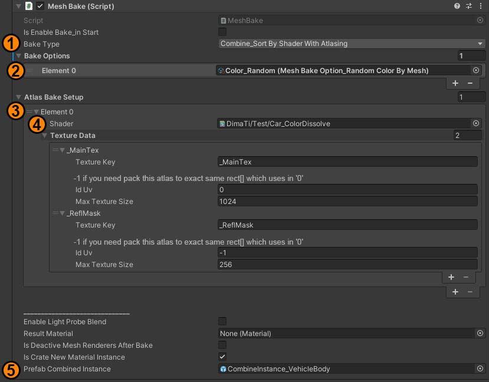

## How to use
- Setup hierarchy => all meshes parented to one object
- AddComponent to parent `MeshBake.cs`
- Setup baking

1. Bake type: `Combine`, `Combine by sort material`, `Combine by sort material with atlasing`
2. Bake options - Drag&Drop scriptableObjects for add options to list (you can make your own option or import existing from samples)
3. Atlas bake setup. (only if you selected `Combine by sort material with atlasing`)
4. Filter by Shader and apply settings (`textureData`)
5. Prefab Combining instance (can be null) - script will instantiate this prefab and set CombinedMesh to this instance

## Old baker features (Deprecated)

Bake system for fast mesh bake in runtime or editor
- Combine
- Combine with sort material (each bake by unique material)
- Combine with random vertex color
- Combine with atlasing
- Combine with atlasing color (vertex color to texture block)
- Separate submeshes
- [Editor] Save meshes to asset files
- [Editor] Save texture atlas to asset
- [Editor] Extract simple colliders

## How to use Old baker (Deprecated)
- Setup hierarchy => all meshes parented to one object (parent must be clear from meshFilter or meshRenderer)
- Drop to parent `MeshCombiner.cs`
- Select bake queue in script
- Use editor buttons if need bake in editor
